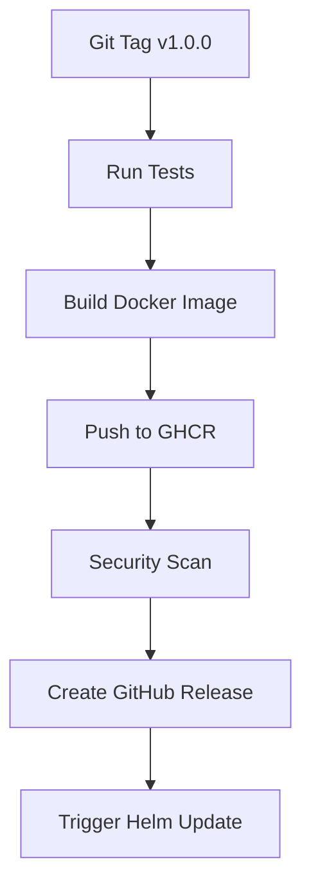
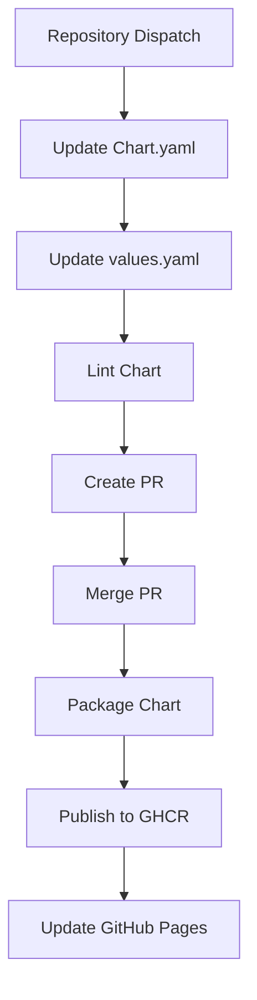

# 🚀 GitHub Actions CI/CD Setup Guide

This guide explains how to set up the complete CI/CD pipeline for the Webhook Monitor application with automated Docker builds, Helm chart publishing, and cross-repository integration.

## 🏗️ Repository Architecture

The project uses a **two-repository architecture** for better separation of concerns:

```
webhook-monitor/                 # Main application repository
├── src/                        # Application source code
├── Dockerfile                  # Container definition
├── .github/workflows/          # CI/CD pipelines
└── README.md

webhook-monitor-helm/           # Helm charts repository
├── charts/webhook-monitor/     # Helm chart
├── .github/workflows/          # Chart automation
└── README.md                   # Chart documentation
```

## 📋 Prerequisites

1. **GitHub Account** with repository creation permissions
2. **Two GitHub Repositories**:
   - `YOUR-USERNAME/webhook-monitor` (main app)
   - `YOUR-USERNAME/webhook-monitor-helm` (helm charts)
3. **GitHub Container Registry** enabled for your account

## 🔧 Setup Instructions

### Step 1: Create Repositories

1. **Main Application Repository**:
   ```bash
   # Push your existing code to GitHub
   git remote add origin https://github.com/YOUR-USERNAME/webhook-monitor.git
   git branch -M main
   git push -u origin main
   ```

2. **Helm Charts Repository**:
   ```bash
   # Create and push the helm repository
   cd c:\git\webhook-helm-repo
   git init
   git add .
   git commit -m "🎉 Initial Helm charts repository"
   git branch -M main
   git remote add origin https://github.com/YOUR-USERNAME/webhook-monitor-helm.git
   git push -u origin main
   ```

### Step 2: Configure GitHub Settings

#### Main Repository (`webhook-monitor`)

1. **Enable GitHub Container Registry**:
   - Go to Settings → Actions → General
   - Enable "Read and write permissions" for GITHUB_TOKEN

2. **Create Personal Access Token**:
   - Go to Settings → Developer settings → Personal access tokens → Tokens (classic)
   - Generate new token with scopes: `repo`, `write:packages`, `workflow`
   - Copy the token (you'll need it for the next step)

3. **Add Repository Secret**:
   - Go to Repository Settings → Secrets and variables → Actions
   - Add secret: `HELM_REPO_TOKEN` = [your personal access token]

#### Helm Repository (`webhook-monitor-helm`)

1. **Enable GitHub Pages**:
   - Go to Settings → Pages
   - Source: "Deploy from a branch"
   - Branch: `gh-pages` / `/ (root)`
   - Save

2. **Enable Repository Dispatch**:
   - The repository will automatically receive events from the main repository

### Step 3: Update Configuration Files

Replace `YOUR-USERNAME` in all files with your actual GitHub username:

#### In Main Repository:
- `.github/workflows/build-and-release.yml`

#### In Helm Repository:
- `charts/webhook-monitor/Chart.yaml`
- `charts/webhook-monitor/values.yaml`
- `.cr.yaml`
- `README.md`

### Step 4: Test the Pipeline

1. **Create a Test Release**:
   ```bash
   # In your main repository
   git tag v0.1.0
   git push origin v0.1.0
   ```

2. **Monitor the Pipeline**:
   - Check Actions tab in main repository
   - Verify Docker image is built and pushed
   - Check Actions tab in helm repository
   - Verify PR is created automatically

## 🔄 Workflow Overview

### Main Repository Pipeline (`build-and-release.yml`)



**Triggered by**: Git tags matching `v*.*.*` pattern

**Stages**:
1. **🧪 Test**: Runs .NET and Node.js tests
2. **🐳 Build & Push**: Multi-platform Docker build to GHCR
3. **🔍 Security Scan**: Trivy vulnerability scanning
4. **📋 GitHub Release**: Automated release creation
5. **🔄 Helm Trigger**: Cross-repository update signal

### Helm Repository Pipeline (`update-chart.yml`)



**Triggered by**: Repository dispatch from main repository

**Stages**:
1. **📝 Update Files**: Chart version and image tags
2. **🧪 Validation**: Helm linting and templating
3. **🔀 Pull Request**: Automated PR creation
4. **📦 Publishing**: Chart packaging and distribution

## 🎯 Release Process

### For Developers

1. **Development**:
   ```bash
   # Make your changes
   git add .
   git commit -m "✨ Add new feature"
   git push origin main
   ```

2. **Release**:
   ```bash
   # Create and push a semantic version tag
   git tag v1.2.3
   git push origin v1.2.3
   ```

3. **Automatic Pipeline**:
   - Docker image built: `ghcr.io/YOUR-USERNAME/webhook-monitor:v1.2.3`
   - GitHub release created with changelog
   - Helm chart PR created automatically
   - After PR merge: Chart published and available

### For Operations

1. **Monitor Releases**:
   - Watch GitHub Actions for pipeline status
   - Review automated Helm chart PRs
   - Monitor security scan results

2. **Deploy to Clusters**:
   ```bash
   # Add the Helm repository
   helm repo add webhook-monitor https://YOUR-USERNAME.github.io/webhook-monitor-helm/
   
   # Install or upgrade
   helm upgrade --install webhook-monitor webhook-monitor/webhook-monitor \
     --version 1.2.3 \
     --namespace webhook-monitor \
     --create-namespace
   ```

## 🔐 Security Features

### Container Security
- **Multi-stage builds** for minimal attack surface
- **Trivy scanning** for vulnerability detection
- **SARIF upload** for GitHub Security tab integration
- **Non-root containers** with security contexts

### Access Control
- **GitHub Container Registry** for secure image storage
- **Personal Access Tokens** for cross-repository access
- **Repository secrets** for sensitive configuration
- **OIDC integration** with GitHub Actions

## 📊 Monitoring & Observability

### Pipeline Monitoring
- **GitHub Actions** dashboard for build status
- **Security alerts** for vulnerability findings
- **Release notifications** via GitHub

### Application Monitoring
- **Health checks** at `/healthz` endpoint
- **Kubernetes probes** for container health
- **SignalR connectivity** verification
- **Clean logging** with health check noise suppression

## 🚨 Troubleshooting

### Common Issues

1. **Docker Build Fails**:
   ```bash
   # Check build logs in Actions tab
   # Verify Dockerfile and dependencies
   ```

2. **Helm Repository Access Denied**:
   ```bash
   # Verify HELM_REPO_TOKEN secret is set
   # Check token permissions include 'repo' and 'workflow'
   ```

3. **Cross-Repository Trigger Fails**:
   ```bash
   # Verify repository names in workflow files
   # Check that helm repository exists and is accessible
   ```

4. **GitHub Pages Not Updating**:
   ```bash
   # Check gh-pages branch exists
   # Verify Pages is enabled in repository settings
   ```

### Debug Commands

```bash
# Test Docker build locally
docker build -t test-webhook-monitor .

# Test Helm chart locally
helm lint charts/webhook-monitor/
helm template test charts/webhook-monitor/

# Check GitHub CLI status
gh auth status
gh repo list
```

## 🎯 Production Recommendations

### Environment Configuration
- Use separate GitHub organizations for dev/staging/prod
- Configure environment-specific secrets
- Set up branch protection rules for main branches

### Security Best Practices
- Enable Dependabot for dependency updates
- Configure CODEOWNERS for review requirements
- Use environment-specific container registries
- Enable audit logging for sensitive operations

### Monitoring Setup
- Configure Slack/Teams notifications for failures
- Set up monitoring for deployed applications
- Create dashboards for pipeline metrics
- Implement log aggregation for troubleshooting

## 🎉 Success Metrics

After successful setup, you should have:

✅ **Automated Docker builds** on every tagged release  
✅ **Multi-platform container images** (linux/amd64, linux/arm64)  
✅ **Security scanning** integrated into pipeline  
✅ **Automated Helm chart updates** via cross-repository PRs  
✅ **GitHub Pages Helm repository** for chart distribution  
✅ **OCI registry publishing** for modern Helm workflows  
✅ **Comprehensive release automation** with changelogs  
✅ **Zero-downtime deployments** with Kubernetes health checks  

Your webhook monitoring application is now production-ready with enterprise-grade CI/CD! 🚀